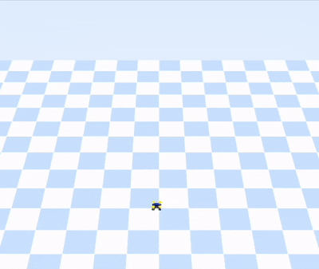
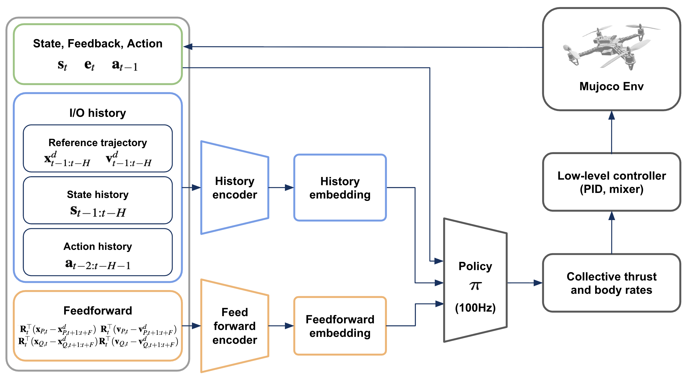

# 🛸 RoVerFly: Robust and Versatile Implicit Hybrid Control of Quadrotor–Payload Systems

**RoVerFly** is a unified **learning-based control framework** for robust and adaptive quadrotor–payload trajectory tracking.  
A single reinforcement learning (RL) policy functions as an *implicit hybrid controller* that learns to handle **taut–slack transitions, payload mass/length variation**, and external disturbances — all without explicit mode detection or controller switching.

This repository contains the full simulation and training framework implemented in **MuJoCo** and **Stable Baselines3**, used for the experiments in our paper:

> **Mintae Kim, Jiaze Cai, and Koushil Sreenath**  
> *RoVerFly: Robust and Versatile Implicit Hybrid Control of Quadrotor–Payload Systems*  
> [[arXiv preprint]](https://arxiv.org/abs/2509.11149)

<p align="center">
  
  
</p>

---

## 🚀 Key Features

### • Unified Learning-Based Controller
- A **single policy** trained with **task and domain randomization** generalizes across payload configurations:
  - No payload → Flexible cable-suspended payload  
  - Varying payload mass and cable length  
- Learns an implicit mode representation for **taut–slack hybrid dynamics**.

### • End-to-End PPO Training
- Built on **Stable Baselines3 (PPO)** with a modular MuJoCo environment.
- Observation includes **present**, **past (I/O history)**, and **future (feedforward preview)** terms for temporal awareness.
- CTBR (Collective Thrust and Body Rate) action parameterization for smooth and physically interpretable control.

### • Realism-Oriented Simulation
- High-fidelity MuJoCo environment with **finite-stiffness cable**, actuator lag, and input delay.
- Domain randomization over dynamics, delays, and sensor noise.
- Robust to disturbances: ±0.5 N force, ±0.005 N·m torque impulses, and randomized initial conditions.

### • Reward and Curriculum
- Exponential tracking-based reward encouraging precise and smooth motion.
- Optional curriculum progression from hover → trajectory tracking → aggressive maneuvers.

---

## 🧠 Environment Overview

| Component | Description |
|------------|--------------|
| **State** | Quadrotor + payload positions, velocities, attitude, angular velocity, cable direction, and payload parameters $(m_P, l)$. |
| **Action (CTBR)** | `[Thrust, Roll Rate, Pitch Rate, Yaw Rate]`, mapped to individual motor thrusts via a low-level PID controller. |
| **Observation** | Concatenation of current state, tracking errors, previous action, short I/O history (H=5), and reference preview (F=10). |
| **Dynamics** | Hybrid taut/slack modes with smooth switching via continuous finite-stiffness cable model. |
| **Training** | PPO with clipped Gaussian noise, 10–30 ms input delay, and randomized physical parameters. |

---

## 🧩 Installation & Usage

### 1. Environment Setup
```bash
git clone https://github.com/mintaeshkim/roverfly.git
cd roverfly
pip install -r requirements.txt
```

### 2. Run Training
```bash
python train/run_quadrotor.py --num_envs 32 --env payload --device cpu --id exp_1
```

---

## 📊 Results Summary
- Stable trajectory tracking across payload configurations
- Rapid recovery from external impulses and noise
- Zero-shot generalization to unseen reference trajectories
- Ablations confirm the critical role of I/O history and feedforward preview

---

## 🧾 Citation

If you use this framework, please cite:
```
@article{kim2025roverfly,
  title={RoVerFly: Robust and Versatile Implicit Hybrid Control of Quadrotor-Payload Systems},
  author={Kim, Mintae and Cai, Jiaze and Sreenath, Koushil},
  journal={arXiv preprint arXiv:2509.11149},
  year={2025}
}
```
Companion papers:
```
@inproceedings{cai2025learning,
  title={Learning-based trajectory tracking for bird-inspired flapping-wing robots},
  author={Cai, Jiaze and Sangli, Vishnu and Kim, Mintae and Sreenath, Koushil},
  booktitle={2025 American Control Conference (ACC)},
  pages={430--437},
  year={2025},
  organization={IEEE}
}
```
```
@article{kim2026finite,
  title={Finite Memory Belief Approximation for Optimal Control in Partially Observable Markov Decision Processes},
  author={Kim, Mintae},
  journal={arXiv preprint arXiv:2601.03132},
  year={2026}
}
```
