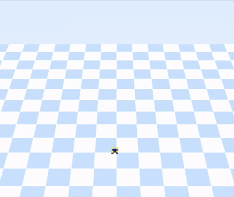
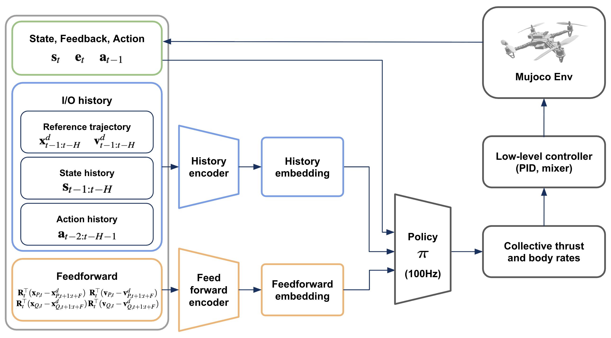

# RoVerFly

RoVerFly is a MuJoCo and Stable-Baselines3 framework for reinforcement-learning control of
quadrotor–payload systems. One policy handles taut/slack cable transitions, payload variation,
actuator delay, and external disturbances without explicit mode switching.

> Mintae Kim, Jiaze Cai, and Koushil Sreenath, *RoVerFly: Robust and Versatile Implicit Hybrid
> Control of Quadrotor–Payload Systems*. [arXiv:2509.11149](https://arxiv.org/abs/2509.11149)

<p align="center">
  
  
</p>

## Install

RoVerFly supports Python 3.10 and 3.11.

```bash
git clone https://github.com/mintaeshkim/roverfly.git
cd roverfly
python3.11 -m venv .venv
source .venv/bin/activate
pip install -e .
```

Optional plotting, export, and development dependencies are available as extras:

```bash
pip install -e '.[plot,export,dev]'
```

## Train

```bash
roverfly train --env payload --num-envs 32 --device cpu --id exp_1
```

Available training environments are `falcon`, `mini`, `payload`, and `random`. Each experiment is
self-contained under `runs/<id>/`, including TensorBoard logs, evaluation results, checkpoints,
and the final model. The three-vehicle `multi` environment remains available through the Python
API for simulation experiments, but is not offered by the training CLI because its cooperative
reward is not yet implemented.

## Evaluate and export

```bash
roverfly evaluate runs/exp_1/checkpoints/best_model.zip --env payload --episodes 20
roverfly export runs/exp_1/checkpoints/best_model.zip --format onnx
```

MNN export additionally requires `MNNConvert` on `PATH`. ONNX export requires the `export` extra.

## Layout

```text
roverfly/
├── assets/        MuJoCo models and textures
├── control/       action filters
├── envs/          Gymnasium environments
├── export/        deployment formats
├── integrations/  ROS integration
├── math/          geometry and rotations
├── simulation/    MuJoCo runtime and rendering
├── training/      PPO configuration and runner
└── trajectories/  reference trajectories
```

## Development

```bash
pytest
ruff check .
```

MuJoCo smoke tests are marked `integration` and can be run explicitly with
`pytest -m integration` on a machine with a working OpenGL runtime.

## Citation

```bibtex
@article{kim2025roverfly,
  title={RoVerFly: Robust and Versatile Implicit Hybrid Control of Quadrotor-Payload Systems},
  author={Kim, Mintae and Cai, Jiaze and Sreenath, Koushil},
  journal={arXiv preprint arXiv:2509.11149},
  year={2025}
}
```
